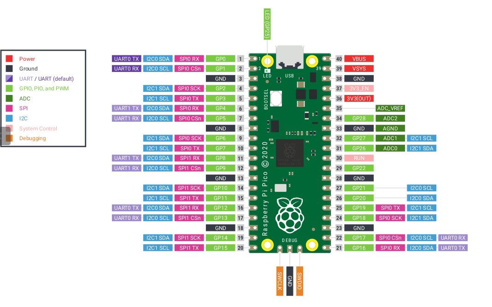

# 配線とピンアサイン

このドキュメントは、各スケッチのデフォルト定数に対応した配線一覧です。実機に合わせて `.ino` の `PIN_*` を変更できます。

## CuGoV4 配線

対象: `cugov4_pico_encoder_control/cugov4_pico_encoder_control.ino`

| 信号名 | GPIO | コード内定数 |
| --- | --- | --- |
| DIR1_L_FWD | GP2 | `PIN_MOTOR_L_DIR_FWD` |
| DIR1_L_REV | GP3 | `PIN_MOTOR_L_DIR_REV` |
| SPEED-OUT_L | GP5 | `PIN_ENCODER_L_A` |
| SPEED-OUT_R | GP7 | `PIN_ENCODER_R_A` |
| DIR2_R_FWD | GP8 | `PIN_MOTOR_R_DIR_FWD` |
| DIR2_R_REV | GP9 | `PIN_MOTOR_R_DIR_REV` |
| ENCODER_DIR_L | GP12 | `PIN_ENCODER_L_DIR` |
| ENCODER_DIR_R | GP13 | `PIN_ENCODER_R_DIR` |
| PWM1_L | GP17 | `PIN_MOTOR_L_PWM` |
| PWM1_R (回路ラベル PWM2_R) | GP19 | `PIN_MOTOR_R_PWM` |

補足:
- エンコーダ速度は `SPEED-OUT_L/R` の立ち上がりエッジでカウントします。
- `kSpeedOutPulsePerRev = 30` がデフォルトです。
- 回転方向は `PIN_ENCODER_*_DIR` の入力で判定します。

### CuGoV4 モータドライバ切替

`kMotorDriverDirectionMode` で切り替えます。

- `MotorDriverDirectionMode::kFwdOnly`:
  - HP-5097J 系向け（方向指令は FWD ピンのみ）
  - REV ピンは未使用（LOW 固定）
- `MotorDriverDirectionMode::kFwdRev`:
  - HM-5100J 系向け（FWD/REV を個別に使用）

## CuGoV3 配線

対象: `cugov3_pico_encoder_control/cugov3_pico_encoder_control.ino`

### エンコーダ (AMT102-V 例)

| 信号 | 左ホイール GPIO | 右ホイール GPIO | 備考 |
| --- | --- | --- | --- |
| A相 (黄色 / pin1) | GP2 | GP8 | `PIN_ENCODER_L_A` / `PIN_ENCODER_R_A` |
| B相 (青色 / pin3) | GP3 | GP9 | `PIN_ENCODER_L_B` / `PIN_ENCODER_R_B` |
| Z相 (紫色 / pin4) | 未配線 (NC) | 未配線 (NC) | 本スケッチでは未使用 |
| 5V (橙色 / pin2) | VBUS または外部 5V | VBUS または外部 5V | エンコーダ電源 |
| GND (茶色 / pin5) | 任意の GND | 任意の GND | Pico と共通 GND |

注意:
- Pico の GPIO は 3.3V 系です。5V ロジック出力を直接入力しないでください。
- オープンコレクタ + 3.3V プルアップ、または[レベルシフタ](https://akizukidenshi.com/catalog/g/g113837/)経由で接続してください。

### モータドライバ (PWM/Dir)

| モータ | PWM ピン (`PIN_MOTOR_*_PWM`) | DIR ピン (`PIN_MOTOR_*_DIR`) |
| --- | --- | --- |
| 左車輪 | GP17 | GP16 |
| 右車輪 | GP19 | GP18 |

Cytron MDDA20A（PWM+DIR）を想定しています。

- Phase/Enable 形式のドライバ:
  - PWM ピンを Enable へ接続
  - DIR ピンを Phase へ接続
- IN/IN 形式の H ブリッジ:
  - PWM ピンを片側入力へ接続
  - もう片側入力を DIR で制御できるよう配線

別の GPIO を使いたい場合は `.ino` 内の `PIN_MOTOR_*` 定数を書き換えてください（PWM 可能な GPIO を割り当ててください）。

## 共通の追加ピン

| GPIO | 機能 | 備考 |
| --- | --- | --- |
| GP4 | BUZZER | ブザー出力 |
| GP22 | LED2 | インジケータ LED |
| GP21 | LED1 | インジケータ LED |
| GP20 | BAT_LED_PWM | バッテリー LED の PWM 制御 |
| GP15 | SW1 | ユーザスイッチ入力 (`PIN_USER_BUTTON`) |
| GP26 | ADC_BAT | バッテリー電圧 ADC 取得 |
